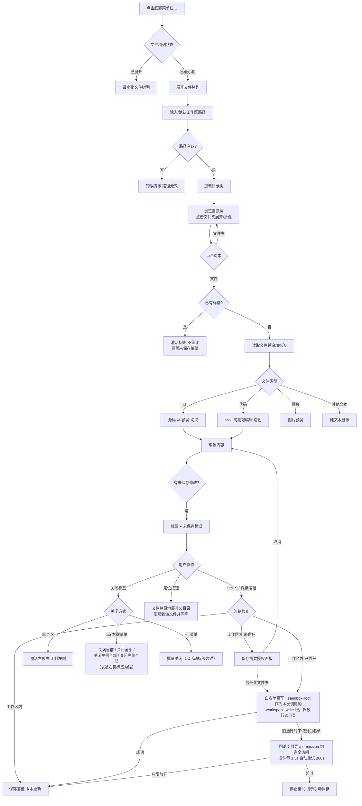
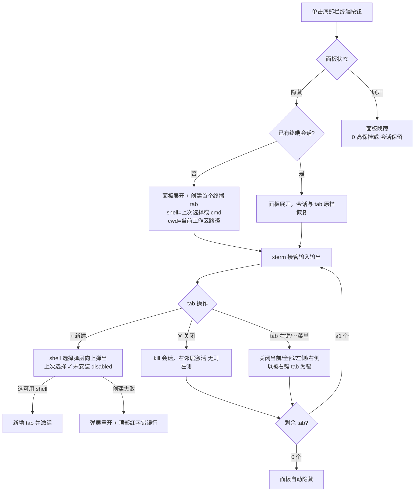
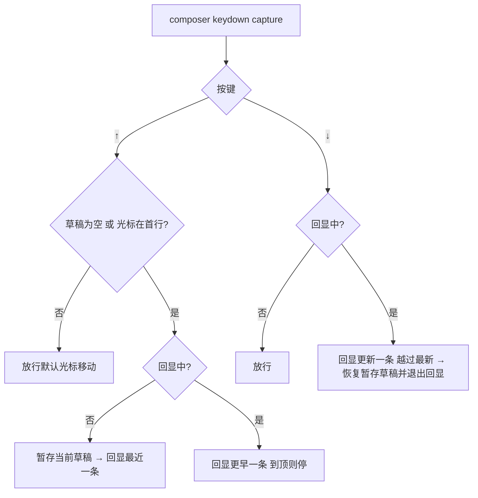
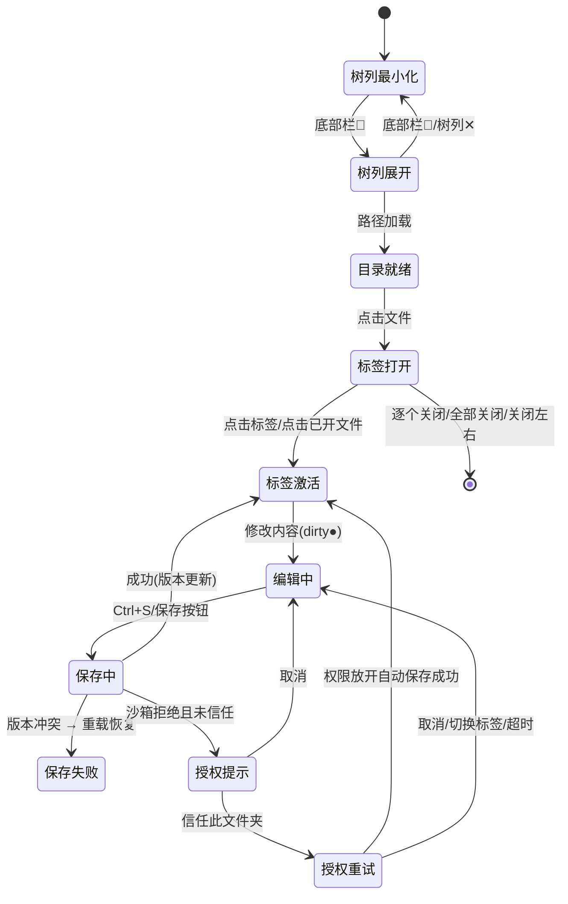
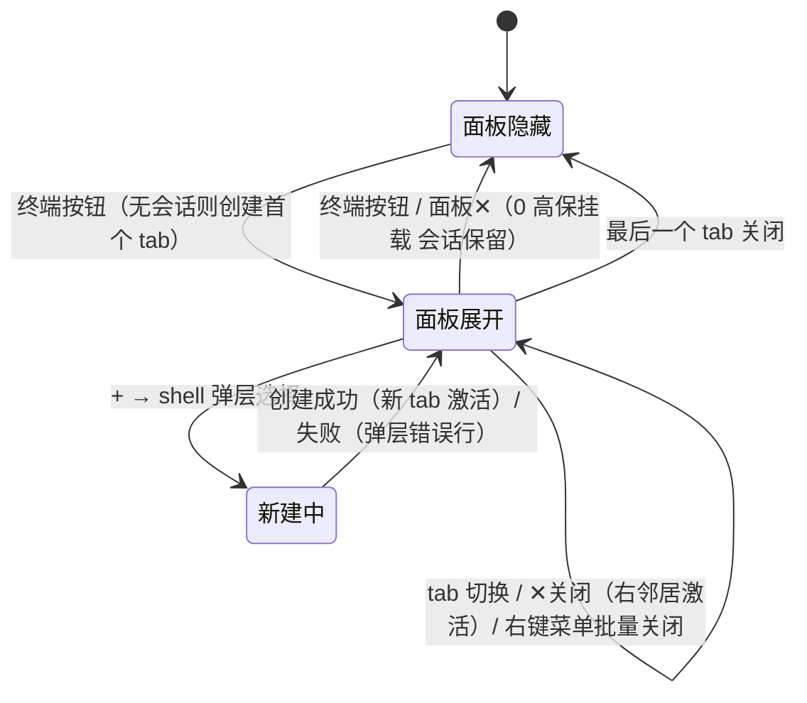
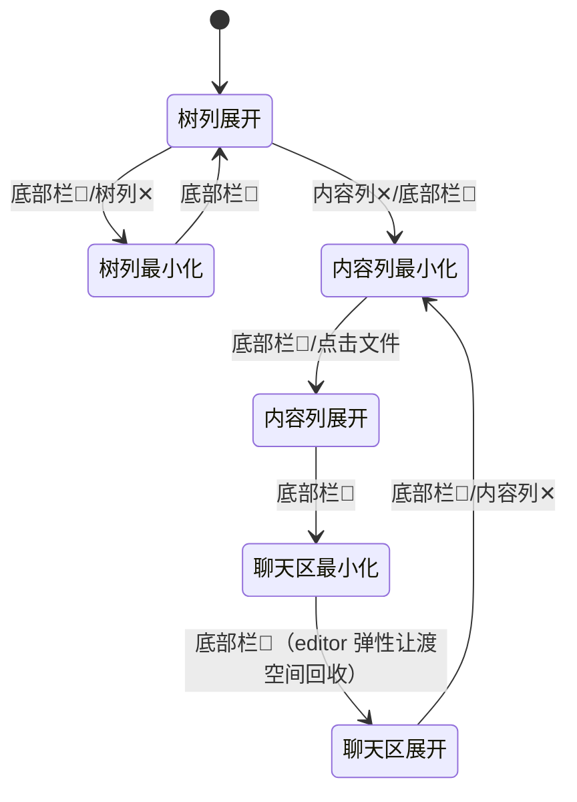
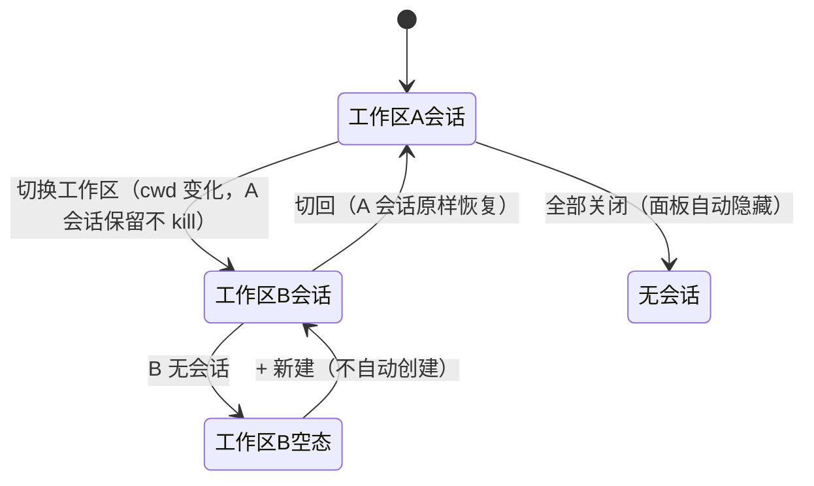
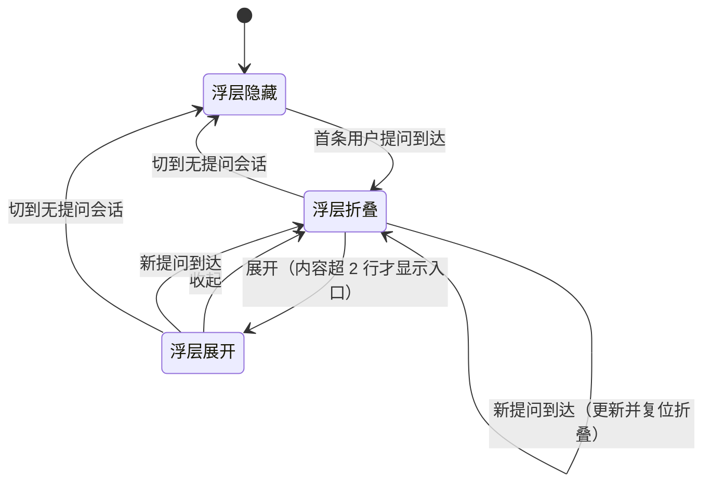
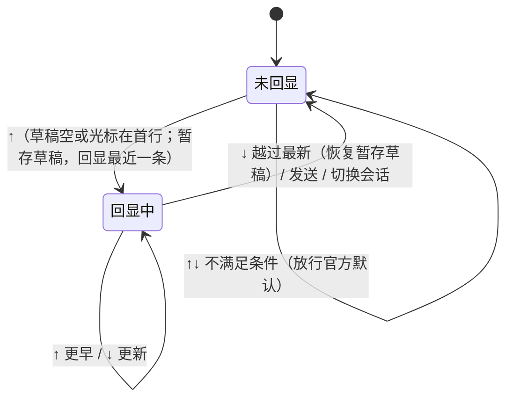

# 文件树面板 · 交互设计

> 功能：一体化开发视图的文件浏览 / 查看 / 编辑（产品概述 P0：文件列表、文件查看与预览、文件编辑与保存）
> 依据：`specs/产品概述.md`（布局方案 C）｜ 文档版本：v2.3（变更 C8 三区最小化 / C9 终端工作区隔离 / C10 提问浮层复制 / C11 HTML 文件预览）

## 1. 功能概述

- **目标**：在 DSH 内获得"工作区 + 文件树 + 文件查看/编辑 + agent 对话"同屏同层级协作的一体化开发视图，80% 的文件查看/预览/编辑场景在插件内完成。
- **用户**：本人（DSH 上的 agent/插件开发者）。
- **验收对照**（产品概述 MVP）：
  - 五列同层级布局：工作区(sidebar) → 文件树 → 文件内容 → 聊天区 → details ✅（方案 C，DevFrame root 框架）
  - 文件树列 / 文件内容列可**独立最小化**（0 宽保挂载，状态保留）✅
  - **聊天区可独立最小化**（0 宽保挂载，官方会话状态保留；空间让渡给内容列）✅（变更 C8）
  - **三区最小化后收缩到底部通用工具栏**：📁 文件列表 / 📝 文件内容 / 💬 聊天区 / >_ 终端 四开关，data-active 标识可见性 ✅（变更 C8）
  - **终端窗口按工作区隔离**：切换工作区展示各自终端，会话保留不 kill ✅（变更 C9）
  - 列宽拖拽调整，树/内容列宽 localStorage 记忆 ✅
  - 多标签文件编辑：逐个关闭 / 全部关闭 / 关闭左侧 / 关闭右侧 ✅（变更 C1）
  - 文件列表开关收口到底部通用菜单栏 ✅（变更 C3）
  - 代码文件 shiki 高亮可编辑（暗色编辑区）✅；md 源码/渲染预览切换 ✅；图片预览 ✅
- **HTML 文件预览**：.html/.htm 源码 ⇄ 沙箱 iframe 预览切换，保存后预览自动刷新 ⬜（变更 C11，待实现）
  - 编辑后未保存标识亮起，Ctrl+S / 保存按钮落盘后消失，保存不弹确认框 ✅
  - 工作区外文件保存被沙箱拒绝 → 信任文件夹授权流（引导 `/permission` + 自动重试）✅
  - 文件内容 → 文件列表"定位"（树内原地逐级展开 + 滚动 + 闪烁，不切换树根）✅

## 2. 用户流程



**分支流程**：
- 文件过大（>1MB）：读取被拦截，提示"文件过大，请用外部编辑器"
- 加载失败：错误提示 + 可重试（重新加载）
- 保存版本冲突：错误提示"文件已变更" + "重新加载"按钮（放弃编辑从磁盘重读）
- 沙箱拒绝：见上方授权流；已信任目录再被拒不重复弹面板，直接进重试
- 列最小化：标签与目录树状态全部保留，点击文件 / 底部栏按钮恢复

## 3. 界面区域清单

| 编号 | 区域 | 入口 | 核心功能 | 关联 |
|------|------|------|----------|------|
| R1 | 文件列表开关 | 底部通用菜单栏（全宽第二 grid 行，32px） | 展开/最小化文件树列（📁开/关图标 + 激活态） | R2 |
| R2 | 文件树列 | R1 按钮 | 路径输入、面包屑、目录树浏览、刷新、最小化 | R3、R4 |
| R3 | 目录树区 | R2 内 | 文件夹懒加载展开/折叠、文件点击打开、定位 reveal | R4 |
| R4 | 文件内容列 | R3 点击文件 | 多标签条（右键关闭菜单）+ ⋯批量关闭、工具栏、高亮编辑器、授权面板 | R3、R5 |
| R5 | 聊天区 | 官方 conversation（第 4 列） | 会话、@文件 引用、片段发送；**可独立最小化（0 宽保挂载，底部栏 💬 还原，C8）** | R4、R7 |
| R6 | details 列 | 官方（工具调用时最右缘弹出） | 工具详情 | — |
| R7 | 底部通用菜单栏 | 常显（sidebar 右侧，columns 2/-1） | **四开关**：📁 文件列表 + 📝 文件内容 + 💬 聊天区 + >_ 终端（C8）；预留通用操作区 | R2、R4、R5、R8 |
| R8 | 终端面板 | 底部栏终端按钮（R7） | 底部内嵌面板（sidebar 右侧区域）：多终端 tab 条（新建/关闭/右键菜单）+ xterm 终端区 + 高度拖拽；0 高保挂载隐藏保会话 | R2、R7 |
| R9 | 当前提问浮层 | 聊天区列内顶部（自动出现） | 展示当前会话最近一条提问；超 2 行默认折叠，支持展开/收起；复制提问全文（C10）；新提问到达即更新 | R5 |
| R10 | 输入历史回显 | 聊天输入框（↑↓ 键） | ↑ 回显上一条历史提问、↓ 前进/恢复暂存草稿；历史 = 当前会话用户提问 | R5 |

### 3.1 R8 终端面板交互详设（变更 C5 · v2 用户变更：内嵌面板 + 多 tab）

**设计基线（全部复用现有插件模式）**：

| 现有模式 | 出处 | 终端面板落地 |
|------|------|------|
| 底部栏单图标按钮 `dskDevBottomBarAction`（单击切换、data-active 高亮） | C3 📁 按钮 | 终端按钮 = 面板显隐开关，行为与 📁 完全同构 |
| 列最小化 0 宽保挂载（组件不卸载、状态全保留） | 树/内容列（M1-4） | 面板隐藏 = 0 高保挂载，终端会话与 tab 全保留 |
| 多标签模型（tabs[] + activePath、✕ 右邻居激活） | C1 fileStore | `termStore` 镜像：termTabs[] + activeTermId |
| tab 右键/⋯关闭菜单（`dskDevCtxMenu`，四动作、被右键 tab 为锚） | C4 | 终端 tab 同一菜单组件与锚点语义；无 dirty 确认 |
| 列宽拖拽 + localStorage 记忆 | 树/内容列宽 | 面板高度 120–480 默认 260，行拖拽手柄 + `termHeight` 记忆 |
| 菜单弹层向上弹出 + 错误红字行（#e66） | C4 菜单 / 列内错误 | + 新建终端的 shell 选择弹层；失败弹层重开 + 错误行 |

**布局（v2 框架变更：sidebar 独占全高，终端面板与底部栏均不占 sidebar 列）**：

```
桌面端（≥768px）
┌──────────┬──────────┬──────────────┬──────────────┬──────────┐
│ sidebar   │ 文件树列  │  文件内容列    │  聊天区       │ details  │
│ (官方)    │          │              │              │          │
│           ├──────────┴──────────────┴──────────────┴──────────┤
│           │ [PowerShell 1 ✕][cmd 2] [+]              [✕隐藏]  │ ← tab 条
│   独占    │ PS C:\work\dsh-develop-ui> _                       │ ← xterm 终端区
│   全高    ├──────────────────────────────────────────────────┤
│           │ [📁] [>_●]                                        │ ← 底部栏（columns 2/-1）
└──────────┴──────────────────────────────────────────────────┘

窄窗口（<768px）：同桌面端（面板默认就在底部横贯，天然适配）；tab 条横向滚动
```

**用户流程**：



**分支流程**：
- 未设工作区路径：+ 弹层顶部提示行「请先在文件树列加载工作区路径」，菜单项全部禁用（首个终端同理：按钮单击 → 面板展开显示该提示空态）
- shell 未安装：弹层项 disabled + 「（未安装）」（现有 `opacity:.4` 规则）
- 创建/连接失败：弹层重开 + 红字错误行；面板已有 tab 不受影响
- 终端进程退出（exit）：tab 保留并标记「已退出」，可 ✕ 关闭（不重连，v2 从简）

**元素清单**：

| 元素 | 类型 | 说明 | 交互行为 | 窄窗口展示 |
|------|------|------|----------|-----------|
| 终端按钮 | button（底部栏 `dskDevBottomBarAction`） | `IconCodeOutline16`（兜底 `>_`），title「终端」 | 单击切换面板显隐；面板展开时 data-active 高亮（对齐 📁） | 同桌面端 |
| 终端面板 | 底部区域（grid-column 2/-1） | 默认高 260px，范围 120–480 | 顶部行拖拽手柄调高，localStorage 记忆；隐藏=0 高保挂载 | 同桌面端 |
| 终端 tab 条 | tab 列表（复用 `dskDevTabBar/dskDevTab` 样式） | 标题 = shell 名 + 序号（PowerShell 1、cmd 2） | 点击激活；悬停显 ✕；**右键弹关闭菜单**：关闭当前/全部/左侧/右侧（被右键 tab 为锚） | 横向滚动 |
| tab ✕ | button | 悬停显示（对齐文件 tab） | 关闭并 kill 会话；激活右邻居（无则左侧）；最后 tab 关闭 → 面板隐藏 | 同桌面端 |
| + 新建按钮 | button（tab 条右端） | + | 单击开 shell 选择弹层（向上弹出，`dskDevCtxMenu`） | 同桌面端 |
| shell 选择弹层 | 弹层（`dskDevCtxMenu` fixed） | 5 shell 纯文字项；上次选择 ✓ | 点可用项创建新 tab；Esc/点外关闭；失败顶部红字错误行 | 宽 min(280px, 92vw) |
| 面板隐藏按钮 | button（tab 条右端） | ✕（title「隐藏面板」） | 隐藏面板，会话保留 | 同桌面端 |
| xterm 终端区 | 画布容器 | 等宽字体、暗色底（对齐编辑器 #0d1117） | 键入/输出；随 tab 切换换绑会话 | 同桌面端 |

### 3.2 R9/R10 聊天区增强详设（变更 C7）

**设计基线（不发明无先例交互）**：

| 现有模式 | 出处 | C7 落地 |
|------|------|------|
| 插件拥有聊天列容器（DevFrame 第 4 列） | M1-4 | R9 浮层直接渲染在列内，absolute 顶部定位，无需官方槽 |
| composer 触达契约（`useInput`/`inputActions.setDraft`，session 域 list 槽注入） | FileRefButton（conversation.input.left） | R10 同槽注册 **null 渲染组件**挂 keydown，复用同一契约 |
| 0 宽保挂载（组件不卸载、状态保留） | 列最小化 / R8 | R10 组件渲染 null 但常驻，监听随会话生命周期 |
| 暗色 token + 圆角 6 + `dskDev*` 样式 | FRAME_CSS | R9 浮层同色系（#161b22 底 / 1px 边框 / 阴影），不遮挡输入区 |

**R9 当前提问浮层**：

```
聊天区列（第 4 列）
┌────────────────────────────┐
│ ┌────────────────────────┐ │ ← 浮层（absolute top:8，左右各 8）
│ │ 最近提问：帮我重构 xxx…  │ │   默认 ≤2 行（line-clamp）
│ │ （超出 2 行时末尾「展开」）│ │   展开后显示全文 + 「收起」
│ │              [复制]      │ │   复制全文 + 「已复制」反馈（C10）
│ └────────────────────────┘ │
│  官方会话消息流（原样）      │
│  …                          │
│  官方 composer（原样）       │
└────────────────────────────┘
```

- **数据源**：`ctx.sessions` 服务订阅（`list.current` → 会话快照 `chat.nodes`，取 kind∈{user,steering} 且 seq 最大者的 content）；新提问到达即更新（C7-0 探针验证，受阻回退 MutationObserver 观察消息列表 DOM）
- **折叠**：默认折叠仅前两行；仅当内容超 2 行时显示「展开」；展开/收起为本地状态，切提问后复位为折叠
- **复制（C10）**：复制按钮常显（不依赖超 2 行），复制当前展示提问的**完整全文**（不受折叠态影响）；`navigator.clipboard.writeText`，权限被拒静默失败（TermPanel 先例）；点击后「已复制」约 1.5s 自动还原，切提问时反馈复位
- **空态**：当前会话无用户提问 → 不渲染（不占位）
- **不做**：点击跳转定位到消息（无先例，后续有需求再评）

**R10 输入框 ↑↓ 历史回显**：



- **历史队列**：当前会话用户提问按时间升序、去重连续重复（与 R9 同一数据管线；发送成功后新提问自动入列）
- **写入**：经 `inputActions.setDraft` 全量替换草稿（FileRefButton 已验证契约）
- **切换会话**：历史队列与回显状态重置
- **冲突约束**：仅拦 ArrowUp/ArrowDown；不满足首行/回显中条件一律放行官方默认行为；若官方 composer 已占用 ↑↓（C7-0 探针确认），收紧为「草稿为空才启动回显」

**异常与边界**：

| 场景 | 表现 |
|------|------|
| 会话无历史提问 | ↑↓ 完全放行，无任何反馈 |
| 历史仅 1 条 | ↑ 回显该条；再 ↑ 停留不动；↓ 恢复暂存草稿 |
| setDraft 不可用（composer 未就绪） | R10 组件静默不挂监听（对齐 FileRefButton 不可用诊断策略） |
| 提问为超长文本 | R9 折叠展示不受限；R10 回显完整写入草稿（原生 textarea 滚动） |
| 复制时剪贴板权限被拒（C10） | 静默失败，无报错无崩溃；按钮反馈仍按 1.5s 还原 |

## 4. 界面结构

### 五列框架（DevFrame，root 槽）
```
┌──────────┬──────────┬──────────────┬──────────────┬──────────┐
│ sidebar   │ 文件树列  │  文件内容列    │  聊天区       │ details  │
│ 会话列表   │ [路径输入] │ [标签1][标签2●]│  官方会话     │ 工具详情  │
│ （官方）   │ 面包屑     │ [⋯][工具栏]   │              │ （官方）  │
│           │ 📁 src    │ ┌──────────┐ │              │          │
│           │  📄 a.ts  │ │ 高亮编辑器 │ │              │          │
│           │           │ └──────────┘ │              │          │
│ 独占全高   ├──────────┴──────────────┴──────────────┴──────────┤
│           │ 终端面板（C5 v2）：tab 条 + xterm 区 + 高度拖拽        │
│           ├──────────────────────────────────────────────────┤
│           │ [📁][📝][💬][>_] 底部通用菜单栏（columns 2/-1）         │
└──────────┴──────────────────────────────────────────────────┘
```

- **列宽契约**：sidebar 264–420（默认 280）、文件树 240–480（默认 360）、文件内容 480–1200（默认 36vw）、details 300–520（默认 360）、聊天区 ≥640；窗口 <1024px 触发让渡链；拖拽手柄 col-resize；树/内容列宽持久化。
- **最小化**：树/内容/聊天列 0 宽保挂载（组件不卸载，树展开态/标签/编辑内容/官方会话全保留）；底部栏四开关还原（C8）。
- **聊天区最小化布局（C8）**：center 列 0 宽保挂载，1fr 弹性让渡给内容列（editor 渲染宽 = viewport − sidebar − tree − details，下限 EDITOR_MIN），空间不浪费；AskFloat 随列隐藏。
- **路径栏**：浅色底（路径清晰可读，已修复深色看不清问题）。

### R4 文件内容列
```
┌────────────────────────────┐
│ [a.ts][README.md● ✕][⋯]      │  ← 标签条（dirty ●；⋯=全部关闭/关闭左侧/关闭右侧）
│ a.ts  [⚠工作区外] [源码][预览] │  ← 工具栏
│ [💾保存][⟳重载][⇱定位][✕最小化]│
├────────────────────────────┤
│ ┌ 保存需要授权 ────────────┐ │  ← 沙箱授权面板（仅被拒且未信任时）
│ │ 文件夹 /x 不在工作区内…   │ │
│ │ [信任此文件夹并授权保存][取消]│ │
│ └────────────────────────┘ │
│ import ...                  │  ← 暗色高亮编辑区（#0d1117 底 + shiki 层 + 透明 textarea）
│ const App = () => {...}     │
└────────────────────────────┘
```

**元素清单**：

| 元素 | 类型 | 说明 | 交互行为 |
|------|------|------|----------|
**元素清单**（底部栏四开关，变更 C8）：

| 元素 | 类型 | 说明 | 交互行为 |
|------|------|------|----------|
| 文件列表开关 | button（底部栏 `dskDevBottomBarAction`） | 📁 开/关图标（IconFolderOpen16/Close16） | 点击切换文件树列；激活态高亮（data-active） |
| 文件内容开关 | button（底部栏） | 📝 编辑图标（IconEditOutline16） | 点击切换内容列显隐（toggle editorOpen）；有标签时 data-active；最小化后底部栏还原（C8） |
| 聊天区开关 | button（底部栏） | 💬 聊天气泡图标（IconNewChatOutline16） | 点击切换聊天列显隐（toggle layout chat）；激活态高亮；最小化后底部栏还原（C8） |
| 终端按钮 | button（底部栏） | >_ 终端图标（IconCodeOutline16） | 单击切换终端面板显隐；面板展开时 data-active 高亮 |
| 路径输入框 | input（浅色底） | 工作区绝对路径 | Enter 或"加载"触发 |
| 刷新按钮 | button | ⟳ 重新加载当前工作区 | 点击刷新 |
| 树最小化按钮 | button | ✕ | 最小化文件树列（底部栏 📁 恢复） |
| 目录树 | 列表 | 目录优先、名称升序 | 文件夹点击展开/折叠（懒加载）；文件点击打开/激活标签 |
| 定位 reveal | 树行为 | 树层级原地逐级展开父目录 | 滚动到目标文件 + 闪烁高亮；不切换树根 |
| 标签条 | tab 列表 | 文件名 + dirty ● + 悬停 ✕ | 点击激活；✕ 关闭（激活右邻居）；**右键弹关闭菜单**：关闭当前/全部/左侧全部/右侧全部（以被右键标签为锚） |
| 标签菜单 | button ⋯ + 弹层 | 批量关闭（活动标签为锚） | 全部关闭 / 关闭左侧所有 / 关闭右侧所有 |
| 工作区外标记 | 文本 ⚠ | 非常驻工作区文件 | title 说明保存限制 |
| 视图切换 | button 组 | 源码/预览（md、html）/高亮（代码）/图片 | 点击切换，按标签独立记忆 |
| 保存按钮 | button | 💾（dirty 时高亮） | 同 Ctrl+S |
| 重载按钮 | button | ⟳（保存失败后橙色提示） | 放弃编辑从磁盘重读 |
| 定位按钮 | button | ⇱ | 展开文件树列 + reveal 当前文件 |
| 内容列最小化 | button | ✕ | 最小化内容列（点击文件恢复） |
| 授权面板 | 卡片 | 目录路径 + 说明 + 动作 | 信任（持久化 + 进重试）/ 取消 |
| 高亮编辑器 | textarea 叠 shiki 层 | 暗色底（#0d1117）等宽字体 | 编辑即 dirty；Ctrl+S 保存；选区 → 发送片段 |
| HTML 预览（C11） | iframe（`sandbox="allow-scripts"`） | `srcdoc` = 最近保存/加载内容快照（previewHtml）；容器白底 `.dskDevHtmlPreview` | 仅渲染不可编辑；保存成功后自动刷新；相对资源不可用（v1 边界）；不授 allow-same-origin / allow-top-navigation |

> 📌 变更 C6（规划中）：内容区展示/编辑形态参考 VSCode 实现——行号 gutter、当前行高亮、查找替换、多光标、括号匹配。内核选型（monaco / CodeMirror 6）待 C6-0 探针收口，替换后本行「textarea 叠 shiki 层」退役，编辑契约（dirty/Ctrl+S/选区片段）不变。

## 5. 字段定义

| 字段 | key | 类型 | 必填 | 校验 | 说明 |
|------|-----|------|------|------|------|
| 工作区路径 | workspacePath | string | 是 | 非空；host `fs.resolve` 校验 | 目录树根 |
| 终端类型 | shell | enum | 是 | host 白名单：powershell/pwsh/cmd/bash（~~wt~~ 为终端模拟器应用，无法嵌入 xterm，已移除） | 弹层选择；不可用项置灰 |
| 终端打开位置 | terminalCwd | string | 是 | 派生自 workspacePath（只读）；host stat 必须为已存在目录 | 终端进程工作目录 |
| 终端 tab 列表 | termTabs | Array<{id, shell, cwd, title}> | — | 打开顺序 | 镜像 fileStore tabs 模型 |
| 活动终端 tab | activeTermId | string | — | 须在 termTabs 内 | '' = 无终端 |
| 终端面板开关 | termPanelOpen | boolean | — | 全局（跨工作区共享） | 0 高保挂载，隐藏保会话 |
| 终端面板高度 | termHeight | number | — | 120–480，默认 260 | localStorage `dsh-develop-ui.termHeight` |
| 上次终端选择 | lastShell | enum | — | 全局（localStorage `dsh-develop-ui.terminalShell`） | + 弹层项 ✓ 标记；创建失败不变更 |
| 终端工作区（C9） | termWorkspaces | Record<cwd, {termTabs, activeTermId, createError}> | — | 按终端 cwd 分组；cwd = session cwd → recentWorkspace → localStorage 回退 | 切换工作区展示各自终端，会话保留不 kill；同 cwd 不同会话共享 |
| 聊天区开关（C8） | chatOpen | boolean | — | 会话内保持（DevLayoutStore，不持久化） | 最小化后底部栏 💬 还原；0 宽保挂载 |
| 标签列表 | tabs | string[] | — | 打开顺序 | 文件路径有序列表 |
| 活动标签 | activePath | string | — | 须在 tabs 内 | '' = 无标签 |
| 信任目录 | trustedDirs | string[] | — | localStorage 持久化 | 信任不绕过沙箱，仅免重复提示 |

表单 Schema → `specs/features/文件树面板/form-schema.json`

## 6. 状态流转



**终端面板状态机（变更 C5 v2）**：



**三区最小化状态机（变更 C8）**：



> 三区最小化互不影响、状态会话内保持；0 宽保挂载使各区域内部状态（树展开/标签/编辑内容/官方会话）全部保留。

**终端工作区隔离状态机（变更 C9）**：



> 面板开关 termPanelOpen 全局共享（跨工作区保持开合态）；tabs/activeId/创建状态按工作区隔离；同 cwd 不同会话共享同一工作区终端。

**聊天区增强状态机（变更 C7）**：





**聊天区增强测试用例**：

| # | 场景 | 输入 | 期望 |
|---|------|------|------|
| Q1 | 首条提问出现 | 发送首条提问 | 浮层出现，默认折叠（≤2 行） |
| Q2 | 超长提问展开收起 | 点「展开」→「收起」 | 展开显示全文；收起回 2 行；不超 2 行无「展开」入口 |
| Q3 | 新提问复位 | 展开状态下再发一条 | 浮层更新为新提问并复位折叠 |
| Q4 | 切到无提问会话 | 切换会话 | 浮层隐藏不占位；切回恢复 |
| Q5 | 空草稿 ↑ 回显 | 草稿为空按 ↑ | 回显最近一条提问 |
| Q6 | 回显遍历恢复 | ↑↑↓再↓ | 逐条向更早/更新遍历；越过最新恢复暂存草稿 |
| Q7 | 发送回显内容 | 回显中按 Enter 发送 | 正常发送；该提问入历史队列；回显态退出 |
| Q8 | 切会话重置 | 回显中切换会话 | 回显退出；历史队列切换为新会话提问 |
| Q9 | 复制提问（C10） | 折叠/展开态点「复制」 | 剪贴板写入完整提问全文；按钮变「已复制」约 1.5s 还原；短提问同样有复制入口 |

**终端面板测试用例**：

| # | 场景 | 输入 | 期望 |
|---|------|------|------|
| T1 | 首次打开 | 单击终端按钮 | 面板在底部展开（不占 sidebar 列）+ 创建首个 tab（上次 shell 或 cmd，cwd=工作区），按钮 data-active |
| T2 | + 新建 | 弹层选 cmd | 新增 tab「cmd 2」并激活；lastShell=cmd |
| T3 | tab 切换 | 点击另一 tab | 激活，xterm 换绑对应会话 |
| T4 | ✕ 关闭 | 关闭当前 tab | 会话 kill；右邻居激活（无则左侧）——对齐文件 tab |
| T5 | 右键菜单 | 右键某 tab | 关闭当前/全部/左侧/右侧（以被右键 tab 为锚，可为非活动 tab） |
| T6 | 全部关闭 | 菜单「关闭全部」或逐 ✕ | 最后 tab 关闭后面板自动隐藏，按钮去高亮 |
| T7 | 隐藏再开 | 按钮切换两次 | 会话与 tab、激活态、面板高度全保留（0 高保挂载） |
| T8 | 未设工作区 | 未加载工作区时新建 | 弹层顶部提示行 + 菜单项禁用 |
| T9 | 不可用/失败 | Git Bash 未安装 / host 创建失败 | 项 disabled「（未安装）」/ 弹层重开 + 红字错误行；lastShell 不变更 |
| T10 | 高度调整 | 拖拽面板顶缘 | 120–480 钳制；刷新后记忆 |

**状态测试用例**：

| # | 场景 | 输入 | 期望 |
|---|------|------|------|
| S1 | 树列开关 | 底部栏📁 → ✕ | 展开→最小化；再次📁 展开，树状态保留 |
| S2 | 路径加载成功 | 有效路径 | 目录树按"目录优先+名称升序"展示 |
| S3 | 路径无效 | 不存在路径 | 错误提示，目录区清空 |
| S4 | 目录展开 | 点击文件夹 | 懒加载子目录，图标 ▸→▾ |
| S5 | 多标签打开 | 连点 3 个文件 | tabs 按打开顺序；再点已开文件仅激活不重读 |
| S6 | 标签关闭 | ✕ / ⋯菜单 | 右邻居激活；全部关闭后内容列隐藏 |
| S7 | 编辑 dirty | 修改文本 | 标签 ● 亮起 |
| S8 | Ctrl+S 成功 | 保存 | 标记消失，版本更新 |
| S9 | 版本冲突 | 外部改了文件后保存 | 错误提示 + 重载按钮，内容保留 |
| S10 | 沙箱拒绝未信任 | 保存工作区外文件 | 授权面板弹出，内容保留 |
| S11 | 信任并授权 | 信任 + 白名单直写 | 携带 sandboxRoot 立即保存成功（旧运行时回退 /permission 重试） |
| S11b | 关闭 dirty 标签 | ✕ / 右键 / ⋯批量关闭 | 拦截弹确认：保存并关闭 / 不保存 / 取消；保存失败标签保留 |
| S11c | tab 右键菜单 | 右键某标签 | 四个关闭动作，以被右键标签为锚（可为非活动标签） |
| S12 | 定位 | 内容列 ⇱ | 树原地展开父目录 + 滚动 + 闪烁 |
| S13 | 大文件 | 打开 >1MB 文件 | 拦截提示"文件过大" |

**HTML 预览测试用例（变更 C11）**：

| # | 场景 | 输入 | 期望 |
|---|------|------|------|
| H1 | html 打开默认源码 | 打开 a.html | 工具栏出现「源码/预览」按钮组，默认源码（monaco 编辑） |
| H2 | 预览渲染与隔离 | 切「预览」 | iframe 渲染页面效果（脚本可运行）；脚本以不透明源运行，无法触达父页存储/DOM |
| H3 | 保存刷新预览 | 编辑 → Ctrl+S | 预览自动更新为已保存内容；dirty ● 消失 |
| H4 | 相对资源边界（v1） | 引用 ./style.css 的 html | 相对资源不加载（srcdoc 基址 about:srcdoc），绝对 URL 资源可用；行为与文档声明一致 |
| H5 | 重载保留视图 | 保存失败后「重新加载」 | viewMode 保留 preview，previewHtml 刷新为磁盘内容 |

## 7. 异常与空状态

| 场景 | 页面表现 | 操作引导 |
|------|----------|----------|
| 终端创建失败 | shell 弹层重开 + 顶部红字错误行 | 重选其他 shell |
| 未设工作区新建终端 | 弹层顶部提示行 + 菜单项禁用 | 先在文件树列输入工作区路径 |
| 终端进程退出 | tab 保留标记「已退出」 | ✕ 关闭该 tab |
| 首次打开（未输入路径） | 树列显示路径输入 | 聚焦路径输入框 |
| 路径无效 / 目录不存在 | 错误提示（红字） | 修正路径重试 |
| 目录为空 | 目录区显示"空目录" | 无 |
| 无标签 | 内容列隐藏（或空态） | 点击文件打开 |
| 加载失败（IO/权限） | 错误提示 + 原因 | "重新加载" |
| 文件过大（>1MB） | 拦截提示 | "请用外部编辑器" |
| 保存版本冲突 | 错误提示"文件已变更" | "重新加载后合并" |
| 沙箱拒绝（未信任） | "保存需要授权"面板 | 信任文件夹 / 取消 |
| 沙箱拒绝（已信任） | 重试中状态 + 提示 | `/permission` 切完全访问 |
| 授权超时（≈60s） | 停止重试 + 错误提示 | 切权限后手动保存 |
| HTML 相对资源不加载（C11 v1） | iframe 内相对引用的样式/图片/脚本缺失 | v1 边界：改用绝对 URL 或内联资源；相对资源支持待 host 静态路由评估 |
| 引用未注入 | 错误提示 | 确认 composer @文件 可用 |

## 8. 验收标准对照

| 产品概述验收 | 交互设计落实 | 状态 |
|------------|-------------|------|
| 五列同层级布局 | DevFrame root 框架 + 底部菜单栏 | ✅ 已实现（待真机复验） |
| 树/内容列独立最小化 | R1/R2✕/R4✕，0 宽保挂载 | ✅ 已实现 |
| 多标签与批量关闭 | 标签条 + ⋯菜单 | ✅ 已实现 |
| md 源码/预览切换 | 视图切换（按标签记忆） | ✅ 已实现 |
| 高亮可编辑（暗色） | textarea 叠 shiki 层 | ✅ 已实现 |
| dirty + Ctrl+S 落盘 | 标签 ● + 保存按钮 | ✅ 已实现 |
| 沙箱保存授权流 | 信任面板 + 自动重试 | ✅ 已实现（待真机验证） |
| 底部终端面板（C5 v2） | 底部栏开关 + 多 tab 面板（tab 关闭参考文件 Tab）+ 高度拖拽（3.1 节） | ✅ 已实现 |
| 聊天区增强（C7） | R9 当前提问浮层（折叠 2 行 + 展开收起 + 复制全文）+ R10 输入框 ↑↓ 历史回显（3.2 节） | ✅ 已实现（待真机复验）；C10 复制待实现 |
| 三区最小化与底部栏还原（C8） | 树/内容/聊天列独立最小化（0 宽保挂载）+ 底部栏四开关（📁📝💬>_，data-active）；聊天列收起后空间让渡内容列 | ✅ 已实现（待真机验证） |
| 终端工作区隔离（C9） | termStore 按 cwd 分组：切换工作区展示各自终端，会话保留不 kill；面板开关全局共享 | ✅ 已实现（待真机验证） |
| HTML 文件预览（C11） | R4 视图切换扩展：.html/.htm 源码 ⇄ 沙箱 iframe 预览（srcdoc 快照，保存后刷新；不授 allow-same-origin/allow-top-navigation） | ⬜ 待实现 |
| 80% 场景不切外部编辑器 | 全流程闭环 | ⏳ 待使用验证 |

## 9. 相关文档

- 任务规划：`specs/features/文件树面板-任务规划.md`（v1.10，含变更任务 C1–C11 与沙箱授权；C8 三区最小化 / C9 终端工作区隔离 / C10 提问浮层复制已实现待真机验证；C11 HTML 预览待实现）
- 技术验证：`docs/开发记录/M0-技术验证.md`（M1 补充：slots 契约与方案 C 接替条件）
- 原型：`specs/features/文件树面板/prototype/`（P1 文件树面板、P2 终端面板、P3 聊天区增强，含窄窗口适配）
