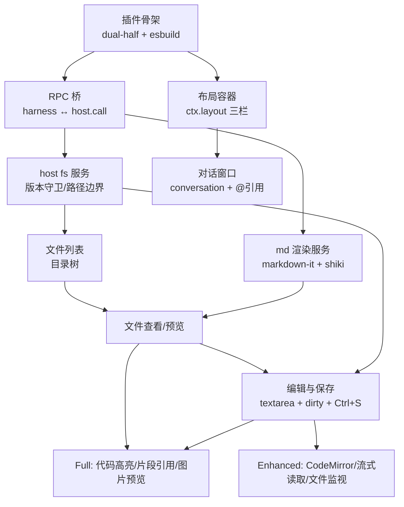

# 开发路线图：dsk-develop-ui

> 依据 `specs/产品概述.md`（板块与优先级）、`specs/技术栈.md` v1.1（模块结构）制定
> 文档版本：v1.0 ｜ 状态：规划完成

## 模块依赖分析

```
插件骨架(dual-half+esbuild)
 ├─→ RPC 桥(harness.handle ↔ host.call + shared 类型)   ← 一切数据通道的前提
 │    ├─→ host fs 服务(listDir/readText/stat/writeText+版本守卫)
 │    │    └─→ 文件列表(目录树)
 │    │         └─→ 文件查看/预览(readText + md.render)
 │    │              └─→ 编辑与保存(textarea+dirty+Ctrl+S)
 │    └─→ md 渲染服务(markdown-it+shiki)
 └─→ 布局容器(ctx.layout 三栏+最小化+状态记忆)
      └─→ 对话窗口(复用 conversation + @文件引用)

关键前置验证（阻塞后续，必须最先做）：
  V1  ctx.layout AppFrame 三栏可用性 + 各栏可最小化
  V2  conversation 组件可嵌入自定义面板（技术栈文档标注的最大风险点）
  V3  client 闭包环境 host.call ↔ harness.handle 双向通道真机可用
```

## 里程碑

### M0 骨架与验证（第 1 周）— ✅ 完成（2026-08-20/21）

| 模块 | 优先级 | 预估工时 | 依赖 | 状态 |
|------|--------|----------|------|------|
| 插件骨架：dual-half 包结构 + esbuild 双入口 + package.json 声明 | P0 | 1 天 | 无 | ✅ 完成 |
| 技术验证 V1/V2/V3（layout 三栏、conversation 嵌入、通道格式） | P0 | 1.5 天 | 骨架 | ✅ 完成（结论：布局方案 A；通道改为 webServer 路由） |
| RPC 桥：harness.handle + host.call（原方案） | P0 | 1 天 | 骨架、V3 | ✅ 完成（**修正**：弃用 harness/host.call，host 半用 ctx.webServer HTTP 路由） |
| 验证结论回写技术栈/产品文档 | P0 | 0.5 天 | V2 | ✅ 完成（v1.2 修正） |

### MVP（第 2-3 周）— ✅ 基本完成（2026-08-21，验收 5/6）

| 模块 | 优先级 | 预估工时 | 依赖 | 状态 |
|------|--------|----------|------|------|
| host fs 服务：listDir/stat/readText + 路径边界检查 + 大文件拦截 | P0 | 1.5 天 | RPC 桥 | ✅ 完成（+隐藏目录过滤/版本守卫写入） |
| 布局编排：DSH 三列（sidebar\|center\|details）| P0 | 1 天 | 骨架、V1 | ✅ 完成（方案 A：文件树 sidebar 面板、内容面板内、对话 center） |
| 文件列表：目录树组件（当前工作区自动检测、懒加载、面包屑、刷新） | P0 | 1.5 天 | fs 服务、布局 | ✅ 完成 |
| 文件查看：readText 展示 + 代码高亮 + 图片预览 | P0 | 1 天 | 文件列表 | ✅ 完成 |
| md 预览：markdown-it 渲染 + 源码/预览切换 + 代码块高亮 | P0 | 1.5 天 | md 渲染、文件查看 | ✅ 完成 |
| 编辑与保存：textarea + dirty + Ctrl+S + writeText 版本守卫 | P0 | 2 天 | 文件查看、fs 服务 | ✅ 完成（+冲突重载） |
| 对话窗口：复用 conversation（center）+ @文件 引用注入 | P0 | 2 天 | 布局容器、V2 | ✅ 完成（@文件/片段引用，文本注入） |

> **里程碑状态**：MVP 验收 5/6 达成（80% 场景项待日常使用验证）；"文件内容入 details 列"实现差异为面板内展示（details 槽为官方工具详情）。见 `docs/开发记录/MVP-验收核对.md`。

### Full（第 4 周）— ✅ 已完成（P1 全部落地）

| 模块 | 优先级 | 预估工时 | 依赖 | 状态 |
|------|--------|----------|------|------|
| 代码文件语法高亮：shiki 高亮非 md 代码文件预览 | P1 | 1 天 | md 渲染服务 | ✅ 完成 |
| 片段级引用：选中代码/文本片段发送给 agent | P1 | 1.5 天 | 对话窗口、文件查看 | ✅ 完成 |
| 权限 UI：保存被沙箱拒绝时的明确提示与引导 | P1 | 1 天 | 编辑与保存 | ✅ 完成（错误提示 + 重新加载） |
| 图片预览：图片文件缩略图/预览 | P1 | 0.5 天 | 文件查看 | ✅ 完成 |

### Enhanced（第 5+ 周，约 4.5 天）— 体验增强（产品概述完整版验收）

| 模块 | 优先级 | 预估工时 | 依赖 | 状态 |
|------|--------|----------|------|------|
| CodeMirror 6 编辑器评估（静态注入桌面壳，行号/高亮） | P2 | 2 天 | 编辑与保存 | 待评估 |
| 大文件流式读取（>1MB 分段加载） | P2 | 1 天 | fs 服务 | 待评估 |
| 文件变更监视（外部修改自动刷新文件列表） | P2 | 1.5 天 | 文件列表 | 待评估 |

## 依赖关系图



## 开发顺序（可执行队列）

1. 插件骨架 → 2. 技术验证 V1/V2/V3 → 3. RPC 桥 → 4. host fs 服务 → 5. md 渲染服务 → 6. 布局容器 → 7. 文件列表 → 8. 文件查看 → 9. md 预览 → 10. 编辑与保存 → 11. 对话窗口+@引用 →（MVP 验收）→ 12. Full 四项 → 13. Enhanced 评估项

## 总工时估算

| 阶段 | 工时 | 日历 |
|------|------|------|
| M0 骨架与验证 | 4 天 | 第 1 周 |
| MVP | 10.5 天 | 第 2-3 周 |
| Full | 4 天 | 第 4 周 |
| Enhanced | 4.5 天（含评估） | 第 5+ 周 |
| **总计** | **约 23 天** | **约 5 周** |

## 风险与应对（纳入里程碑门槛）

| 风险 | 影响 | 应对 |
|------|------|------|
| V2 失败：conversation 无法嵌入自定义面板 | 对话窗口方案推翻 | M0 验证后立即切换自建对话（工时 +2 天，Full 顺延） |
| V1 失败：ctx.layout 不支持三栏自定义 | 布局容器需自绘 | M0 验证后自绘 CSS Grid 三栏（工时 +1.5 天） |
| writeText 受沙箱策略拦截 | 保存链路不通 | MVP 保存实现时同步验证会话写权限；权限 UI 从 Full 提到 MVP |
| 闭包环境额外限制（未知） | 各 client 模块受阻 | M0 V3 用真实最小用例压测 host.call 通道 |

## 下一步

- 使用 `/project-initialization` 初始化项目骨架（M0 第 1 项），随后进入 M0 技术验证
